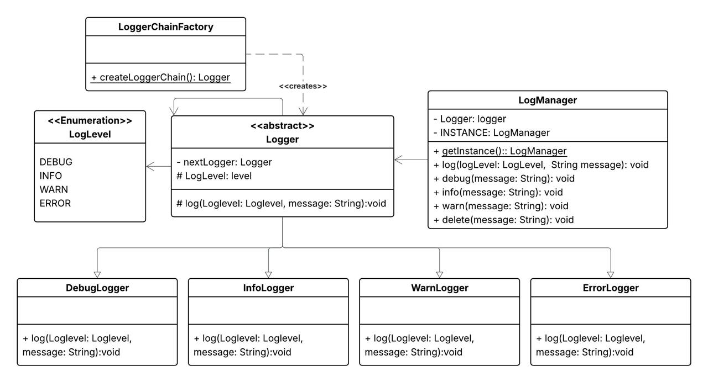

# Chain of Responsibility Logger

A production-grade, extensible logging framework built in Java using core design patterns and clean architecture principles.

This project demonstrates how to design a scalable, thread-safe logging system similar to real-world enterprise loggers while showcasing strong object-oriented design, SOLID principles, and design pattern usage.

---

## Features

* Chain of Responsibility based log routing
* Thread-safe Singleton Log Manager
* Extensible log levels
* Clean separation of concerns
* DRY logging pipeline
* Timestamped logs
* Sealed class hierarchy (modern Java design)
* Factory-based logger chain creation

---

## Design Patterns Used

### Chain of Responsibility (Core Pattern)

Each logger handles one specific log level and passes the request forward if it cannot handle it.

### Logger Priority Order

The logger chain is constructed in the following priority order:

```
DEBUG → INFO → WARN → ERROR
```

This means:

* DebugLogger receives the request first
* If not handled, it is passed to InfoLogger
* Then to WarnLogger
* Finally to ErrorLogger

Benefits:

* Decoupled handlers
* Flexible ordering
* Easy extensibility
* Eliminates large conditional logic

---

### Singleton Pattern

`LogManager` ensures a single global logging entry point.

Thread safety is achieved using:

* Double-checked locking
* ReentrantLock
* Volatile instance reference

---

### Factory Pattern

`LoggerChainFactory` builds the logger pipeline cleanly and prevents:

* Hardcoded dependencies
* Tight coupling
* Complex initialization logic

---

## Project Structure

```
io.github.kartiksethi
│
├── enums
│   └── LogLevel.java
│
├── loggers
│   ├── Logger.java
│   ├── DebugLogger.java
│   ├── InfoLogger.java
│   ├── WarnLogger.java
│   ├── ErrorLogger.java
│   ├── LoggerChainFactory.java
│   └── LogManager.java
```

---

## Class Diagram

The following diagram illustrates the relationships between logger components and how the Chain of Responsibility is structured.

<p align="center">
  
</p>

---

## How the Logger Chain Is Built

The chain is assembled inside `LoggerChainFactory`:

```java
Logger errorLogger = new ErrorLogger(null);
Logger warnLogger = new WarnLogger(errorLogger);
Logger infoLogger = new InfoLogger(warnLogger);
return new DebugLogger(infoLogger);
```

This creates the following flow:

```
DebugLogger → InfoLogger → WarnLogger → ErrorLogger
```

Each logger either handles the request or delegates it forward.

---

## How It Works

### Step 1 — Client logs message

```
LogManager.getInstance().info("Server started");
```

---

### Step 2 — Central Processing

`LogManager`:

* Adds timestamp
* Delegates to logger chain

---

### Step 3 — Chain Traversal

Each logger checks:

```
if (this.level == logLevel)
    handle
else
    pass to next logger
```

---

### Step 4 — Final Handling

If no logger matches the level, an exception is thrown.

---

## Core Components

### LogLevel Enum

Defines supported logging levels:

```
DEBUG
INFO
WARN
ERROR
```

This can be extended easily.

---

### Logger (Abstract Sealed Class)

The central class in the chain.

Responsibilities:

* Holds reference to next logger
* Stores log level it handles
* Implements delegation logic

Key design characteristics:

* Sealed class prevents uncontrolled extension
* Clear separation of responsibilities

---

### Concrete Loggers

Each concrete logger:

* Handles one specific log level
* Prints formatted output
* Delegates otherwise

Examples:

* DebugLogger → handles DEBUG
* InfoLogger → handles INFO
* WarnLogger → handles WARN
* ErrorLogger → handles ERROR

---

### LoggerChainFactory

Responsible for assembling the logger pipeline in priority order:

```
DEBUG → INFO → WARN → ERROR
```

This keeps initialization logic separate from business logic.

---

### LogManager (Singleton)

Acts as the central entry point.

Responsibilities:

* Thread-safe instance management
* Timestamp formatting
* Delegation to logger chain
* Public convenience methods:

```
debug()
info()
warn()
error()
```

---

## Thread Safety

Ensured through:

* Volatile instance reference
* ReentrantLock
* Double-checked locking pattern

This guarantees safe concurrent access without performance bottlenecks.

---

## Example Usage

```java
public class Main {
    public static void main(String[] args) {
        LogManager logger = LogManager.getInstance();

        logger.debug("Debugging...");
        logger.info("Application started");
        logger.warn("Low memory warning");
        logger.error("Database connection failed");
    }
}
```

---

## Extending the System

To add a new log level:

1. Add a new enum value in `LogLevel`
2. Create a new logger class extending `Logger`
3. Register it inside `LoggerChainFactory`

No existing code needs to be modified.

---

## SOLID Principles Demonstrated

Single Responsibility Principle
Each logger handles exactly one log level.

Open/Closed Principle
New loggers can be added without modifying existing ones.

Dependency Inversion Principle
Clients depend on abstraction (`Logger`) rather than concrete implementations.

---

## Real-World Relevance

This architecture is similar to:

* Log4j routing pipelines
* Spring Security filter chains
* Middleware request pipelines
* Event handler chains

---

## Author

Kartik Sethi
Associate Software Engineer
Java | Spring Boot | System Design | Competitive Programming

---

## License

MIT License
