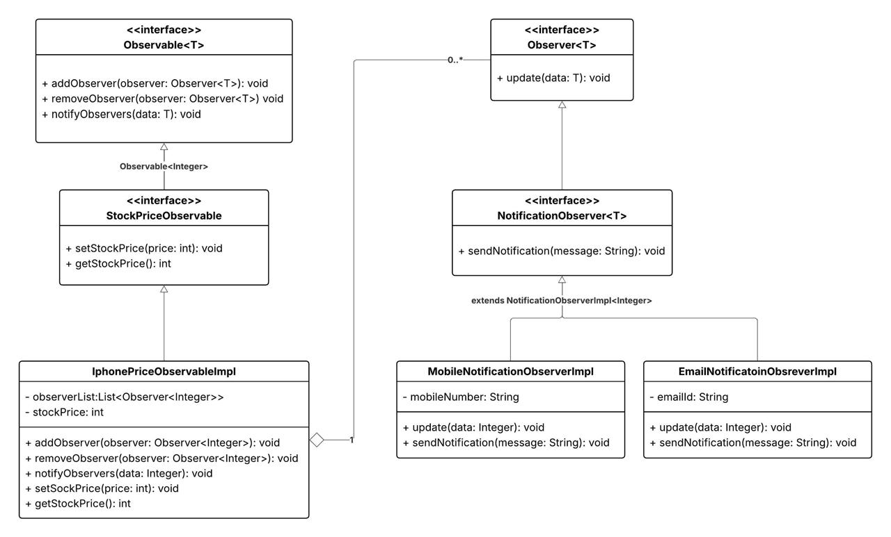

# Observer Pattern Notification System

A production-grade, extensible event notification framework built in Java using core design patterns and clean architecture principles.

This project demonstrates how to design a scalable, loosely coupled, and reusable event subscription system similar to real-world notification pipelines while showcasing strong object-oriented design, SOLID principles, and practical design pattern usage.

---

## Features

* Generic event publishing framework
* Dynamic observer subscription management
* Push-based notification model
* Loose coupling between publishers and subscribers
* Extensible and reusable design
* Clean separation of framework and domain layers
* Support for multiple notification channels
* Type-safe generics-based architecture

---

## Design Pattern Used

### Observer Pattern (Core Pattern)

The system follows a publish–subscribe model where:

* An Observable maintains state
* Multiple Observers subscribe to updates
* Whenever state changes, all observers are notified automatically

This eliminates direct dependencies between components and promotes flexible event-driven communication.

---

## Project Structure

```
io.github.kartiksethi
│
├── observable
│   ├── Observable.java
│   ├── StockObservable.java
│   └── IphoneObservableImpl.java
│
├── observer
│   ├── Observer.java
│   ├── NotificationObserver.java
│   ├── EmailNotificationObserverImpl.java
│   └── MobileNotificationObserverImpl.java
```

---

## Class Diagram

The following diagram illustrates the relationships between observables and observers and how the Observer pattern enables decoupled communication.

<p align="center">
  
</p>

---

## How the System Works

### Step 1 — Observers Subscribe

Observers register themselves to receive updates.

```
observable.addObserver(observer);
```

---

### Step 2 — State Changes

The observable updates its internal state.

```
observable.setStockPrice(newPrice);
```

---

### Step 3 — Automatic Notification

The observable notifies all registered observers.

```
notifyObservers();
```

---

### Step 4 — Observers React

Each observer independently processes the update.

```
observer.update(data);
```

---

## Core Components

### Observable Interface

Defines the contract for all event publishers.

Responsibilities:

* Managing observer subscriptions
* Notifying observers when state changes

Key methods:

```
addObserver()
removeObserver()
notifyObservers()
```

---

### StockObservable (Domain Abstraction)

A specialized observable representing stock price updates.

Responsibilities:

* Managing stock price state
* Providing domain-specific behavior

This demonstrates layered abstraction design:

Generic Framework → Domain Interface → Concrete Implementation

---

### IphoneObservableImpl

Concrete implementation of the observable.

Responsibilities:

* Maintaining current stock price
* Triggering notifications on state change
* Managing subscribed observers

---

### Observer Interface

Defines how subscribers receive updates.

```
void update(T data);
```

This uses a push model, ensuring loose coupling between components.

---

### NotificationObserver Interface

Extends the Observer abstraction with domain behavior.

```
sendNotification(data)
```

This separates notification logic from update handling.

---

### Concrete Observers

Two notification channels are implemented:

* EmailNotificationObserverImpl — Sends email-style notifications
* MobileNotificationObserverImpl — Sends mobile-style notifications

Each observer reacts independently without affecting others.

---

## Example Usage

```java
public class Main {
    public static void main(String[] args) {
        StockObservable observable = new IphoneObservableImpl();

        Observer<Integer> emailObserver =
                new EmailNotificationObserverImpl("user@gmail.com");

        Observer<Integer> mobileObserver =
                new MobileNotificationObserverImpl("9876543210");

        observable.addObserver(emailObserver);
        observable.addObserver(mobileObserver);

        observable.setStockPrice(50000);
    }
}
```

---

## Extending the System

To add a new notification channel:

1. Create a new class implementing NotificationObserver
2. Register it using addObserver()

No existing code needs to be modified.

---

## SOLID Principles Demonstrated

Single Responsibility Principle  
Observable manages state, observers handle reactions.

Open/Closed Principle  
New observers can be added without modifying existing code.

Dependency Inversion Principle  
System depends on abstractions rather than concrete implementations.

Interface Segregation Principle  
Observers implement only behavior relevant to them.

---

## Real-World Relevance

This architecture is widely used in:

* Notification services
* Event-driven systems
* Messaging platforms
* Cache invalidation systems
* UI event frameworks
* Reactive programming models

It also forms the conceptual foundation behind:

* Kafka publish–subscribe systems
* Spring application event framework
* Reactive streams architectures

---

## Author

Kartik Sethi  
Associate Software Engineer  
Java | Spring Boot | System Design | Competitive Programming

---

## License

MIT License
