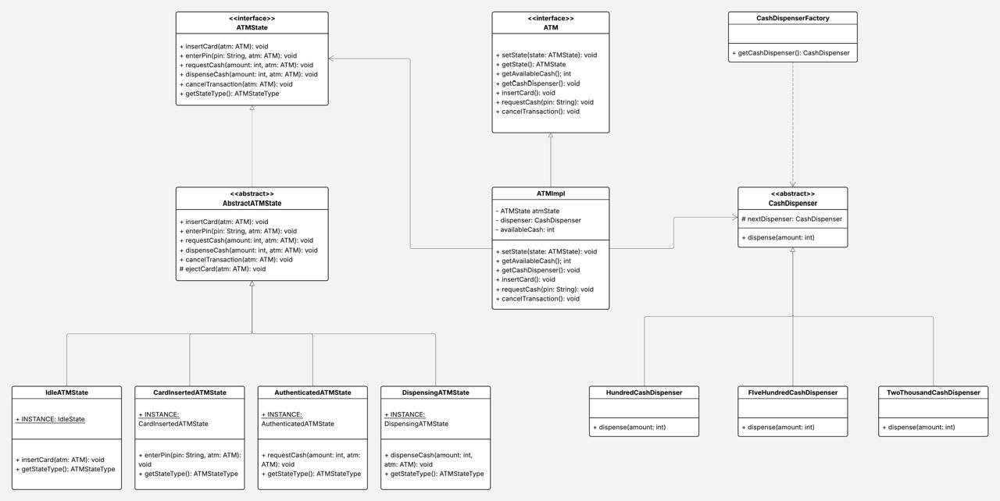

# ATM Machine Simulator – Low Level Design (LLD)

A production-style ATM machine simulator built in **Java** using core **Object-Oriented Design Principles** and widely used **Design Patterns**.

This project demonstrates how to design a scalable, extensible ATM system similar to real-world banking machines while showcasing strong low-level design skills and clean architecture.

---

## Key Features

* State-based ATM workflow
* PIN authentication flow
* Cash withdrawal validation
* Dynamic cash dispensing using denominations
* Extensible and modular design
* Clear separation of responsibilities

---

## Design Patterns Used

### 1. State Pattern (Core ATM Behavior)

The ATM changes its behavior based on its internal state:

```
Idle → Card Inserted → Authenticated → Dispensing → Idle
```

Each state encapsulates its own logic, eliminating complex conditional statements and making the system easy to extend.

**States Implemented:**

* `IdleATMState`
* `CardInsertedAtmState`
* `AuthenticatedATMState`
* `DispensingATMState`

---

### 2. Chain of Responsibility (Cash Dispensing)

Cash is dispensed using a denomination chain:

```
2000 → 500 → 100
```

Each dispenser:

* Handles its denomination
* Passes the remaining amount to the next dispenser

This models how real ATMs distribute currency notes.

---

### 3. Factory Pattern

A `CashDispenserFactory` constructs the dispenser chain, ensuring loose coupling and centralized configuration.

---

## Class Diagram

The following UML diagram represents the overall architecture and relationships between components.

<p align="center">
  
</p>

---

## Project Structure

```
atm/
 ├── ATM.java
 ├── ATMImpl.java

atmStates/
 ├── ATMState.java
 ├── AbstractATMState.java
 ├── IdleATMState.java
 ├── CardInsertedAtmState.java
 ├── AuthenticatedATMState.java
 ├── DispensingATMState.java

cashDispenser/
 ├── CashDispenser.java
 ├── TwoThousandCashDispenser.java
 ├── FiveHundredCashDispenser.java
 ├── HundredCashDispenser.java
 ├── CashDispenserFactory.java
```

---

## How It Works

### Flow of Execution

1. User inserts card and ATM moves to Card Inserted state.
2. User enters PIN and authentication is validated.
3. User requests withdrawal and amount is verified.
4. ATM dispenses notes using the dispenser chain.
5. Transaction completes, card is ejected, and ATM returns to Idle state.

---

## Sample Execution

```java
ATM atm = new ATMImpl(50000);

atm.insertCard();
atm.enterPin("1234");
atm.requestCash(3700);
```

### Output

```
Card Inserted
Pin entered
Withdrawal request accepted
Dispensing cash...
1 x 2000 notes dispensed
3 x 500 notes dispensed
2 x 100 notes dispensed
Transaction complete
Card ejected
```

---

## Design Principles Followed

* SOLID principles
* Open/Closed principle
* Single Responsibility principle
* Composition over inheritance
* Encapsulation of state logic

---

## Why This Project Matters

This project demonstrates:

* Real-world low-level design thinking
* Proper application of design patterns
* Writing maintainable and extensible code
* Strong object-oriented modeling skills

It is suitable for showcasing in software engineering interviews, system design preparation, and backend development portfolios.

---

## Possible Future Enhancements

* Account and bank service integration
* Note inventory tracking
* Multi-user concurrency handling
* Transaction logging
* Structured exception handling

---

## Author

Kartik Sethi
| Software Engineer | Java Backend Developer | Competitive Programmer
